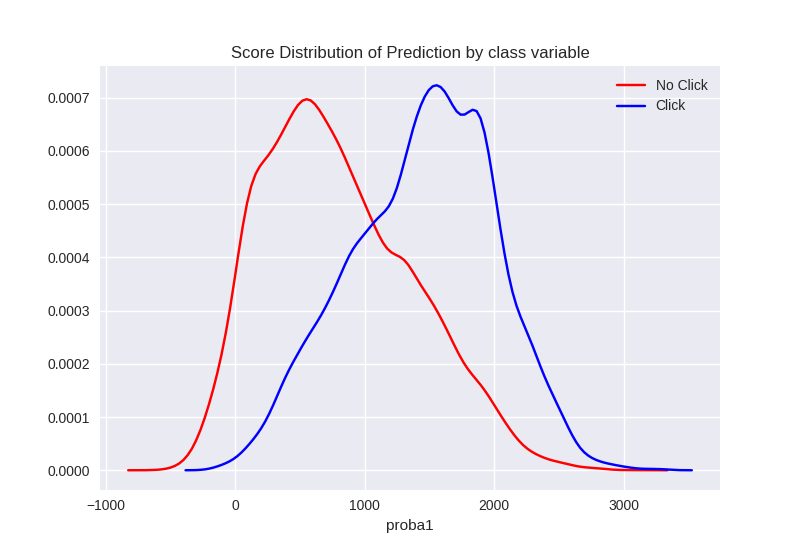

## Data Available:
I have log files for Bidding, Impression, click and conversion and my aim is to maximize the click through rate which is given as 
Click Through Rate is given as: 
$$CTR = \frac{Number Of Clicks}{Number Of Impression} * 100$$

Here I have 4 tables Bidding, Impression, Click and Conversion.

## Problem Formulation:

In online advertising Impression is when an ad is fetched from its source, and it is viewed.
For this ad to be viewed various bids are made and of them the bid with most monetary benefits is chosen(depends on what is to be achieved). To maximize the click through rate we need to improve the number of clicks per impression. So in this case if we select bids which are more likely to be clicked then our click through rate can be increased.     

Hence in this problem I will select the Impressions table and add a column for the bids which are clicked and thus will treat this as binary class supervised problem and find the probability of clicking for each bid.    

Q. Why choose impression table instead of bid table?  
A. for a user, the ads present in impression table are only visible and not all ad from bid table. Hence, we want to find that out of the visible adds which add does the user clicks

After I have learned the model I will fit that on the bidding data and get the probabilities of clicking and then select the ads which has the higher probability and select them as impressions.     

## Breakdown of Data to test, validation and training:

We have bidding data for one extra day, impression and click data from 19 to 26, 

    Training Data: impression data from first 7 day
    Test Data: impression data for 8th day
     

## Imbalance measure of data

In the following figure we can see the percentage of clicked ads in the impression data for 8 dates as below 

   

After we divide the dataset into training and testing the percentage of minority classes is as follows

    Training Data: 0.087%
    Test Data: 0.098%

this is higly imbalanced class and if we train a machine learning algorithm it will give precision almost 0 every time as there are lot of negative samples than positive ones

So to resolve this I downsampled the majority class that is class with click=0 and upsampled the minority class using SMOTE and got them to a ratio of 1:1

## Feature engineering

For feature engineering we need the domain knowledge to extract meaningful features.    
- Firstly took the numerical features like width, height, slotPrice, etc and normalized them to 0-1 so that the variance in them is reduced.     
- I did one hot encoding of the categorical variables(dropping one of the category after encoding) 

I ignored few values(not a good idea) like timestamps, useragent, userTag(due to high number) as these would increase the dimensionality of my model and due to lack of computational power at my end I made peace with the feature vector of 418 features    

I have plotted the heatmap to get correlation among numeric features as follows
    
I see that there is some negative correlation on height and width and some positive correlation between width and bidprice.

## Machine learning models     
I implemented in all 6 models out of which 4 were basic and without any tuning     

### Basic Models     
At first I took 4 basic models as Logisitic Regression, Decision Tree, Naive Bayes and SVM on the Training data whose majority class was downsampled and the ratio of majority class to minority class is 10:1.     
I determined the metrics using 5 fold cross validation.    

Following is the boxplot of their accuracy   

As the dataset originally is highly imbalanced and after downsampling of majority class too is imbalanced hence accuracy is not the right measure

as the number of 1s are far less than that of 0s hence I decided to focus on Precision. Following is the box plot of the precision scores(Note: The ratio of minority to majority class is 1:10).    
   

As expected decision tree was better performing model than the others as it handles unbalance data in a better way than the others here.    

### Random Forest    
For this model I upsample the minority class by using SMOTE(Synthetic Minority Over-sampling Technique) which generates synthetic data using k Nearest Neighbors.  
In this model I use 500 estimators or trees having maximum depth 4, after training the model I get the following results for Confusion Matrix on train data itself     

For training data I get an Accuracy of 78.35%, Precision 74.72% of and Recall of 85.67%

For Testing data I get the confusion matrix as follows    

I test data I get an Accuracy of 82.33%, Precision 0.33% of and Recall of 60.07%     

Following are the important features where the important features in order are 'visibility_FirstView', 'height', 'slotPrice', 'bidprice', 'width', 'visibility_Na', 'adexchange_2.0', 'visibility_OtherView', 'adexchange_1.0', 'payPrice', 'adexchange_3.0', 'city_97', 'visibility_SecondView', 'visibility_ThirdView', 'city_191', 'city_220', 'city_202', 'city_334', 'city_216', 'city_280'    

There are high error bars or standard deviation which may indicate that the features are not very predictive, so they get picked almost randomly which leads to high standard deviations from tree to tree, these error bars can also be reduced using proper depth and number of trees selection. This can be solved using extensive hyperparameter search using grid search approach or trying multiple times with different parameters

### Neural Network
I used the same features used in Random Forest model to train a Deep neural network[500, 250, 40] which I built using Tensorflow to using Relu activation in hidden layer and softmax with cross entropy which computes the cross entropy of the softmax hence the sum may not be 1. I used dropout regularization to prevent overfitting.    

      
      
I stopped training the at epoch 100 abruptly and I get the following results    

     
     
The distribution of the scores at the last layer are as follows:

In ideal case the distribution for click should be to the right most and and that for no click should be towards the left which indicates good seperation. In this case there is some overlap in the distribution. 

I still believe we can improve the performance of this Neural Network using extensive hyperparameter search to get the optimal values of the parameters. I need to experiment with the structure of the layers which could improve the precision.     

## Future Work     
- We can work with other techniques like online learning or incremental learning in batch where we feed the classifier with data for one day at a time and adjust the weights so that they learn as the data grows.     
- We can also model this as an anomaly detection problem as the click data is far less and consider that an anomaly.     
- We can also build seperate classifiers like one for modelling user behaviour one for advertisement and other to consider logs from conversion and check how that data affects the click data and then combine all these models together to fit on the data.

